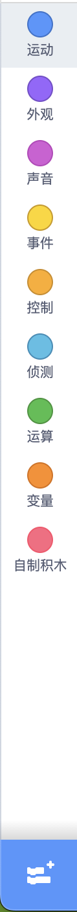
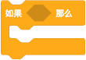

## 块是什么

在[关于程序]中，我们提到过“程序是人们为计算机设计的一组指令，编写程序的过程就是编写命令的过程”。

在 Scratch 中，我们不编写命令；而是使用图形“块”表示命令，编写程序的过程就是排列“块”的过程。这些“块”就像拼图游戏一样，垂直连接成程序脚本，“块”有着各种形状、大小和颜色；您可以将“块”组合起来创建项目。**块就是指令。** 每个**“块”代表您希望程序执行的特定命令、动作或功能**。

“块”通常比文本编程更容易使用，因为“块”不需要像键入命令那样被记住，并且不会发生语法错误。但是不能因为“块”易于使用，而否定文本编程，文本编程更加灵活，可以轻松编辑代码，无需将一个“块”拖到编辑器中。

## 块的分组

{ width=60 }

这些用于编程的“块”，一共有 125 个，根据其功能进行分组，共有九个内置的“块”：运动(Motion)、外观(Looks)、声音(Sound)、事件(Events)、控制(Control)、侦测(Sensing)、运算(Operators)、变量(Variables)、列表(List)、自定义(My Blocks)

每个块类别都用一个圆圈表示，每个圆圈都有不同的颜色。块的颜色相同意味着执行的任务类似。

每个类别都有执行不同功能的“块”。


参考：https://www.codingal.com/coding-for-kids/blog/exploring-scratch-the-world-of-code-blocks/


## 块的用法

### 运动块(Motion)
|数量|18个|
|--|--|
|颜色|深蓝色|
|功能|1. **让角色在屏幕上移动、滑动、反弹或旋转**。2. **存储角色的位置、方向和速度**。|
|作用对象|角色 （不能做用于背景，因为背景不能移动）|


|运动块|说明|技巧|特点|类型|
|--|--|--|--|--|
||移动指定步数|善于使用变量、随机数|瞬间移动|堆栈块|
||移动到特殊位置(随机位置、角色位置、光标位置)||瞬间移动|堆栈块|
||移动到指定坐标||瞬间移动|堆栈块|
||移动X距离|配合循环侦测鼠标的X坐标|瞬间移动|堆栈块|
||移动到指定X坐标||瞬间移动|堆栈块|
||移动Y距离||瞬间移动|堆栈块|
||移动到指定Y坐标||瞬间移动|堆栈块|
||指定时间内滑动到特殊位置(随机位置、角色位置、光标位置)||缓慢移动|堆栈块|
||指定时间内滑动到指定坐标位置||缓慢移动|堆栈块|
||设置旋转方式(左右翻转、任意旋转、不可旋转)|设置不可旋转后再旋转可修改朝向|旋转|堆栈块|
||旋转指定角度(顺时针)||旋转|堆栈块|
||旋转指定角度(逆时针)||旋转|堆栈块|
||设置面向角度||旋转|堆栈块|
||设置面向鼠标指针||旋转|堆栈块|
||反弹就是远离伴随翻转(任意翻转：对称翻转；左右翻转：水平翻转；不旋转：不翻转)||翻转|堆栈块|
||存储角色的X坐标值||值|汇报块|
||存储角色的Y坐标值||值|汇报块|
||存储角色的角度||值|汇报块|

### 外观块(Looks Block)
|数量|20个|
|--|--|
|颜色|紫色|
|功能|**控制角色或背景的外观**。外观包括：更换造型、显示或隐藏、说话、改变大小、堆叠顺序、特效|
|作用对象|14 个仅用于角色，4 个仅用于舞台|

|外观块|说明|特点|类型|
|-|-------|--|--|
||将舞台背景更改为造型列表中的下一个|更换造型|堆栈块|
||更改舞台背景。参数：上一个 下一个 随机|更换造型|堆栈块|
||更改角色的造型。参数：造型列表（如果有）|更换造型|堆栈块|
||更改角色造型为造型列表中的下一个|更换造型|堆栈块|
||一个想法泡泡出现在角色上方并停留指定的时间。|说话|堆栈块|
||角色上方会出现一个想法泡泡，只有当角色说出或想到其他事情时才会消失。|说话|堆栈块|
||角色上方会出现一个对话气泡并停留指定的时间|说话|堆栈块|
||角色上方会出现一个对话气泡，只有当角色说出或想到其他事情时才会消失。|说话|堆栈块|
||显示角色|可见性|堆栈块|
||隐藏角色|可见性|堆栈块|
||按指定量修改特效|特效|堆栈块|
||清除角色上的所有图形效果|特效|堆栈块|
||将特效设置为指定值|特效|堆栈块|
||按照指定步数排列角色图层|堆叠顺序|堆栈块|
||置顶或置底角色图层|堆叠顺序|堆栈块|
||按指定量更改角色的大小|改变大小|堆栈块|
||将角色的大小设置为指定值|改变大小|堆栈块|
||存储角色的尺寸|值|汇报块|
||存储舞台背景的编号和名称。|值|汇报块|
||存储角色当前造型的编号或名称。|值|汇报块|


### 声音块(Sound Block)
|数量|9个|
|--|--|
|颜色|粉紫色|
|功能|**为角色或背景添加声音**。声音包括：音效和音乐，格式为`.wav`或`.mp3`；具体的功能包括：添加声音、停止声音、更改音效、更改音量、录制声音|
|作用对象|角色或舞台。|

|声音块|说明|特点|类型|
|-|-------|--|--|
||暂停执行脚本直至声音播放完毕|播放|堆栈块|
||播放声音而不暂停脚本|播放|堆栈块|
||停止所有播放声音|停止|堆栈块|
||按量修改音效(音调、左右平衡)|音效|堆栈块|
||把音效(音调、左右平衡)设置为指定值|音效|堆栈块|
||清除当前存在的所有音效。|音效|堆栈块|
||按量修改音量|音量|堆栈块|
||把音量设置为指定值(正值增大音量 负值减小音量)|音量|堆栈块|
||存储音量值|音量|汇报块|


### 事件块(Event Block)
|数量|8个|
|--|--|
|颜色|黄色|
|功能|**让你决定事件发生时会发生什么**。例如，您可以让角色在按下按键时跳跃，或者在单击绿旗时开始游戏。|
|作用对象|角色或舞台|

|事件块|说明 (记住六大事件：启发键比点背)|技巧|特点|类型|
|-|-------|--|--|--|
||当点击绿旗时,激活脚本||启动事件|帽子块|
||当按下指定键时，激活脚本(仅当事件释放后才会再次触发该事件)||键盘事件|帽子块|
||单击角色时，激活脚本。||点击事件|帽子块|
||当切换到所选背景时，激活脚本。|用好背景事件事半功倍|背景事件|帽子块|
||当第一个值大于第二个值时，激活脚本 ||比较事件|帽子块|
||当收到广播时，激活脚本||收到广播事件|帽子块|
||在整个 Scratch 程序中发送广播，激活设置为该广播的 When I Receive () 模块。||发出广播|堆栈块|
||与 Broadcast () 块类似，但暂停脚本，直到完成由广播激活的所有脚本。||暂停脚本发出广播|堆栈块|


### 控制块(Control Blocks)
|数量|11个|
|--|--|
|颜色|浅橙色|
|功能|**控制块可帮助您在代码中创建循环、条件和序列。**。您可以让您的角色按照您的指示一步步执行或重复操作，直到满足特定条件。他们“控制”项目并加强其运行。|
|作用对象|角色或舞台|

|控制块|说明|特点|类型|
|-|-------|--|--|
||将脚本暂停一段时间。||堆栈块|
||重复指定次数的循环。||堆栈块|
||除非按下停止符号或通过 Stop () 块停止脚本，否则永远不会结束的循环。||堆栈块|
||检查条件，如果条件为真，则激活其中的块。||堆栈块|
||检查条件，如果条件为真，则第一个 C 内的块将激活，如果条件为假，则第二个 C 内的块将激活。||堆栈块|
||— 暂停脚本，直到条件为真。||堆栈块|
||— 一旦条件为真就会停止的循环。||堆栈块|
||— 停止通过下拉菜单选择的脚本。当选择“此精灵中的其他脚本”时，也可以是堆栈块。||堆栈块|
||（仅限精灵）-每当创建克隆时都会触发此帽子块，并且仅由该克隆运行。||堆栈块|
||— 创建指定的克隆。||堆栈块|
||（仅限精灵）— 删除克隆。||堆栈块|


### 侦测块(Sensing Blocks)
|数量|18个|
|--|--|
|颜色|青色|
|功能|**侦测块可以帮助您的角色根据项目中发生的情况做出决策。它们可以检测鼠标点击、按键，甚至其他字符的位置。**|
|作用对象|角色或舞台|

|侦测块|说明|特点|类型|
|-|-------|--|--|
||— 检查精灵是否正在触摸鼠标指针或另一个精灵的条件。||堆栈块|
||— 检查精灵是否接触特定颜色的条件。||堆栈块|
||— 检查精灵上的颜色是否接触特定颜色的条件。||堆栈块|
||— 从精灵到鼠标指针或另一个精灵的距离。||堆栈块|
||出现一个输入框 - 输入一个值并将该值存储在答案变量中。||堆栈块|
||— 使用 Ask () And Wait 模块的最新输入。||堆栈块|
||— 检查指定键是否被按下的条件。||堆栈块|
||— 检查指定键是否被按下的条件。||堆栈块|
||— 鼠标指针的 X 位置。||堆栈块|
||— 鼠标指针的 Y 位置。||堆栈块|
||— 将精灵设置为可拖动或不可拖动。||堆栈块|
||— 麦克风感应到的噪音有多大。||堆栈块|
||— 自 Scratch 程序打开或计时器重置以来已经过去了多长时间。||堆栈块|
||— 重置计时器。||堆栈块|
||— 舞台或精灵的 X 位置、Y 位置、方向、服装、大小或体积。||堆栈块|
||— 选择的指定时间单位。||堆栈块|
||— 自 2000 年以来的天数。||堆栈块|
||— 用户的用户名。||堆栈块|

### 运算块(Operators Block)
|数量|18个（7个布尔块、11个报告块|
|--|--|
|颜色|绿色|
|功能|**运算块用于执行数学运算和字符连接。**您可以添加数字、比较值，甚至创建复杂的方程。这些块非常适合让您的游戏变得更智能、更具互动性。|
|作用对象|角色或舞台|

|运算块|说明|特点|类型|
|-|-------|--|--|
||用于执行数值的加法运算||布尔块|
||用于执行数值的减法运算||布尔块|
||用于执行数值的乘法运算||布尔块|
||用于执行数值的除法运算||布尔块|
||创建两个数字之间的随机数字||报告块|
||检查一个值是否大于另一个值的条件||布尔块|
||检查一个值是否小于另一个值的条件。||布尔块|
||检查两个值是否相等的条件。||布尔块|
||如果两个条件都为真，则为真。||布尔块|
||如果任一条件为真，则为真。||布尔块|
||检查条件是否为假、不为真、或为真、不为假。||布尔块|
||这两个值紧挨着放置。||布尔块|
||值的指定字符||布尔块|
||值的长度||布尔块|
||检查第一个参数的文本是否包含第二个参数的文本 - 如果包含，则块返回 true。||布尔块|
||该部门的剩余部分。||布尔块|
||将值四舍五入到最接近的整数。||布尔块|
||绝对值 (abs)、平方根 (sqrt)、正弦 (sin)、余弦 (cos)、正切 (tan)、正弦 (asin)、亚余弦 (acos)、正切 (atan)、自然对数 (ln)、指定值的对数 (log)、指数函数 (e^) 或以 10 为底的指数函数 (10^)。||布尔块|

### 变量块(Variables Block)

编程术语中的变量只是一个可以存储某些值的容器。我们可以简单地想象一个里面有数字的盒子。当程序需要时，可以使用增量或减量运算符来增加或减少框中的数字。


变量基本上在内存中存储变化的值。它们的设计方式使得它们只能在其中存储一个值，并且存储在其中的值可能会有所不同，从数字到字符串或布尔值。能够保存这些信息使我们能够在程序中的许多不同位置引用和操作它。这种能力使变量变得非常有用。例如，123、abc、真/假等。

|数量|5个|
|--|--|
|颜色|橙色|
|功能|**变量块用于存储项目中的数据。**您可以创建变量来跟踪分数、玩家姓名或您需要的任何其他信息。|
|作用对象|角色或舞台|

|变量块|说明|特点|类型|
|-|-------|--|--|
||创建变量||堆栈块|
||默认存储变量的值货报告变量的值||汇报块|
||修改变量值||堆栈块|
||增大或减小变量值||堆栈块|
||显示变量的舞台监视器(监视器用于显示项目中的变量数据，双击改变监视器外观)||堆栈块|
||隐藏变量的舞台监视器||堆栈块|
||建立列表||堆栈块|

变量有三种类型

- 全局变量：默认变量。这意味着它可以从项目或舞台中的任何精灵进行更改或访问，无论它是在哪个精灵上创建的。 Scratch 允许用户或程序员通过显示选项“为所有精灵选择”或“仅选择此精灵”来选择全局变量。如果用户或程序员选择“选择所有精灵”，则该变量将成为全局变量，因为任何需要它的人都可以访问它。所有全局变量都存储在 RAM 中，并且它们是创建它们的文件的默认值。

局部变量：它只能从创建它的精灵上进行更改或访问。没有其他精灵可以访问该变量。 Scratch 允许用户或程序员通过显示选项“为所有精灵选择”或“仅选择此精灵”来选择局部变量。如果用户或程序员选择“仅选择此精灵”，则该变量将成为本地变量，并且只有当前精灵可以访问它。

云变量：它是一个变量，允许用户在暂存的服务器上存储变量。云变量的变量名前面有一个类似云的符号，并且它们的更新速度非常快。从Scratch 3.0开始，云变量仅支持数值数据，数据大小仅为256个字符。在单个 Scratch 项目中，您可以创建 10 个云变量。


创建变量的方法

在 Scratch 中，您可以通过两种不同的方式创建变量：

1. 使用内置变量：Scratch有一个内置变量，名为“我的变量”，因此用户可以直接使用它。在这里，您还可以更改变量的名称。另外，如果您想在舞台上显示此变量，请选中“我的变量”块左侧的复选框。

2. 用户定义变量：如果用户希望使用不同的名称创建自己的变量，则单击变量选项板中的“创建变量”按钮。单击“创建变量块”后，屏幕上将出现一个表单。现在，填写变量的名称，新变量将被创建，如下所示。
  点击“确定”后，如下图所示，变量a已创建。

变量在scratch中有什么用？

变量对程序员有巨大的帮助。下面列出了 Scratch 中变量的一些用法：

- 最常见的用途是存储值。例如，如果项目要求用户输入名称然后记住该名称，则该名称将存储在变量中。稍后可以检索该名称。

- 它有助于编写高效且耗时较少的脚本。由于变量的值可以更改，因此变量通常在包含数字的块中使用。


让我们了解两个项目中变量的使用。

1. 不使用变量

```js
第1步：单击事件块并选择表示程序开始的第一个控制块（将其拖动到中心）

步骤2：转到运动块并拖动“change x by 10”块并将其放置在上述步骤下方并将10更改为3

第三步：转到控制块并拖动“等待1秒”并将其放置在上面的块下方

步骤4：转到运动块并拖动“change x by 10”块并将其放置在上述步骤下方并将10更改为4

第5步：转到控制块并拖动“等待1秒”并将其放置在上面的块下方

第6步：转到运动块并拖动“change x by 10”块并将其放置在上述步骤下方并将10更改为5

第7步：现在运行程序
```

下面是程序的实现：

图片

2. 使用变量

正如我们所看到的，上面的代码既麻烦又耗时。因此，我们可以使用变量使这段代码变得简单而快速。让我们看看如何。

```js

步骤1：单击事件块并选择表示程序开始的第一个控制块（将其拖动到中心）。

步骤2：转到变量块并将“将我的变量设置为0”拖到上述步骤下方。将0更改为2。

步骤3：转到控制块并将“repeat 10”拖到上述步骤下方。将10更改为3。

第4步：转到运动块并拖动“change x by 10”块并将其放置在上述步骤下方，并将10更改为“我的变量”。

第5步：转到控制块并拖动“等待1秒”并将其放置在上面的块下方。

第6步：转到变量块并将“将我的变量更改1”拖到上述步骤下方。

第7步：现在，运行该程序。

```
下面是程序的实现：


我们可以看到变量的使用使代码变得高效并且有助于减少代码行。当程序中使用变量时，代码的可读性也增加了。


如何重命名变量？


### 自制积木(My Blocks)
|数量|1个|
|--|--|
|颜色|粉红色|
|功能|**自制积木允许您使用自己的命令创建自定义块。**这就像发明你自己的编码语言一样，它可以使你的项目超级独特。|
|作用对象|角色或舞台|

|自制积木块|说明|类型|
|-|-------|--|
|||堆栈块|

## 块的类型

块是用于在 Scratch 中创建代码的拼图形状。这些块像拼图游戏一样垂直连接，其中 6 种块类型中的每一种都有自己的形状和插槽形状以供插入。

块有六种不同形状：

- 8 个 Hat 块
- 5 个 C 块
- 34 个 Reporter 块
- 14 个Boolean blocks
- 2 个 Cap 块
- 62 个Stack Blocks


### 帽子块(Hat blocks)


帽子块位于代码顶部并启动脚本。它们通常由事件触发，例如点击绿旗或角色，或者通过感知环境中的某些东西来触发。 Scratch 中有二十六个帽子块。有一些帽子积木的例子。

所有帽子块都是控制块、事件块、我的块或扩展块。在实验查看器中，他们名字的第一个单词是大写的。

- Hat blocks是启动脚本的块。
- Hat blocks的顶部是圆形的，底部是凸起的(这样用户只能在它们下面放置方块)。 
- 8 个 Hat 块
    - 6 个位于“事件”类别中
    - 1 个位于“控制”类别中
    - 1 个位于“我的块”类别中（如果创建了 1 个自定义块）。


### 堆栈块(Stack blocks)


堆栈块是最常见的，并且构成脚本的核心部分。它们垂直连接并包含一个接一个执行的指令。

正如您所看到的，它们的形状在顶部有一个凹口，在底部有一个凸起，因此可以将块放置在它们的上方和下方。有 62 个堆栈块。


- Stack Blocks是执行特定命令的块。
- Stack Blocks的形状是顶部有一个凹口，底部有一个凸起(这样可以将方块放置在它们的上方和下方)。
- 有 62 个Stack Blocks——最常见的块形状。

### 布尔块(Boolean blocks)


布尔块返回 true 或 false。它们在条件和控制结构中使用，以在代码中做出决策。

它们具有拉伸的六边形形状。这些块被插入到具有相同形状的其他块的孔中。

- Boolean blocks是充当条件的块,用于插入其他blocks中，比如：reporter block。
- Boolean blocks具有细长的六边形形状。
- Boolean blocks可以保存和报告“真”或“假”值。

### 汇报块(Reporter blocks)


汇报区块提供信息。它们在使用时返回一个值，例如角色的位置或数学计算的结果。它们经常在其他块内使用。

它们具有圆角形状，可以容纳数字和字符串。

- Reporter blocks是充当值的块。
- Reporter blocks的边缘呈圆形。
- Reporter blocks可以容纳数字和字符串。
- Reporter blocks还可以容纳变量。理论上，可以为每个变量和列表创建无限数量的 Reporter 块。
- 这些块被插入到具有相同形状的其他块的孔中。

### C块(C blocks)


C 模块是专门的报告模块，可用于创建自定义数学方程。

C块是呈“C”形状的块。这些块循环 C 内的块或检查条件是否为真。有五个 C 块，它们可以在 Control 类别中找到。

- C块是呈“C”形状的块。这些块也称为“Wrap 块”，它们循环 C 内的块或检查条件是否为真。
- Control 类别中有五个 C 块。 
- C 块可以在底部凸出，允许将块附加在下面，或者加盖，但不允许在下面放置任何块。


### Cap blocks


Cap 块位于脚本末尾并表示其完成。它们用于完成脚本，并不是每个脚本都需要它们。

正如您所看到的，它们的形状是顶部有凹口和平底。 Scratch 有两个 Cap 块，可以在 Control 类别中找到。


- Cap blocks是结束脚本的块。
- 它们的形状是顶部有凹口和平底（这样就不能在它们下面放置方块）。
- 有两个 Cap 块，都可以在“控制”类别中找到。

## 扩展块

### 画笔扩展块

画笔扩展块允许角色控制画笔绘制不同颜色的像素和形状。

使用画笔可以轻松绘制点、线、正方形、矩形和圆形。

然而，也可以通过使用适当的脚本来创建其他形状。

当您打开 Scratch 时，默认情况下无法使用笔扩展。要使用它们，必须在编辑器的“扩展”部分中启用它们。

全部擦出：用于去除 Scratch 中所有由笔和冲压留下的痕迹。

图章：该笔块用于创建精灵的位图图像，该图像将被标记到舞台上。该块属于堆栈块的类别。

落笔：精灵使用此笔块在移动时连续绘制轨迹，直到使用“pen up ()”块为止。

抬笔：该笔块用于阻止精灵因“落笔（）”块而连续绘制轨迹。该块属于堆栈块的类别。

将笔的颜色设为：该笔块用于根据给该块的输入设置笔的颜色。该块属于堆栈块的类别。

将笔的颜色增加：该笔块用于通过给定块的输入数量来更改给定的指定值（第一个输入）。该块属于堆栈块的类别。要添加或更改第一个输入，可用选项包括颜色、饱和度、亮度和透明度。

将笔的颜色设为：该笔块用于设置由给定块的输入数量给定的指定值（第一个输入）。该块属于堆栈块的类别。要添加或更改第一个输入，可用选项包括颜色、饱和度、亮度和透明度。

将笔的粗细增加：该笔块用于根据给该块的输入更改笔的大小。该块属于堆栈块的类别。

将笔的粗细设为 ：该笔块用于根据给该块的输入设置笔的大小。该块属于堆栈块的类别。


### 添加画笔


## 总结

恭喜！您已经了解了有关编码块以及如何在 Scratch 中使用它们的所有内容。每当您在 Scratch 上创建项目时，您都必须使用不同的编码块。

Scratch 是一款功能强大的工具，可让您释放创造力并以有趣且引人入胜的方式学习编码基础知识。