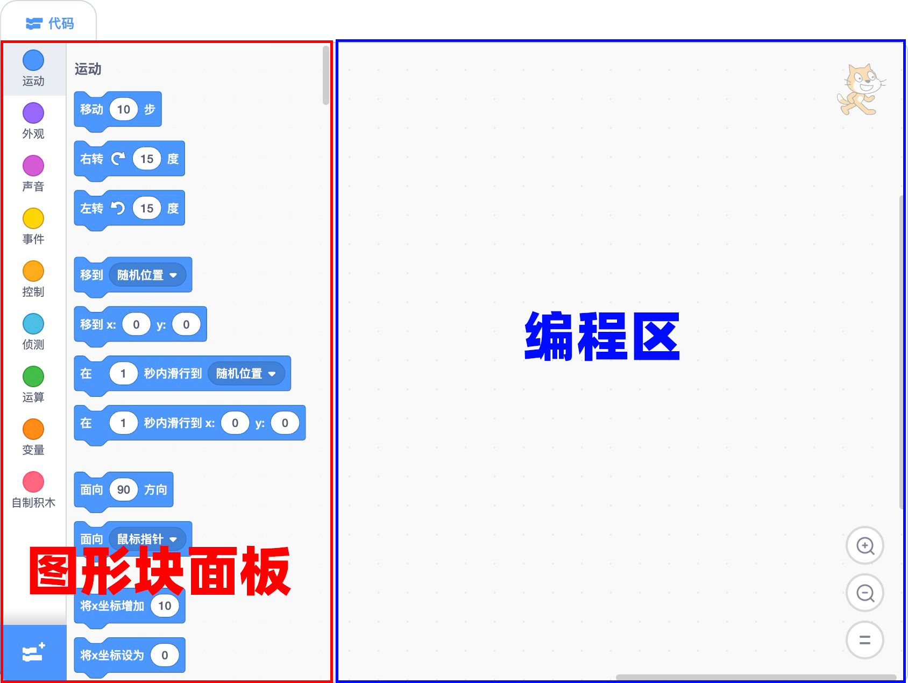
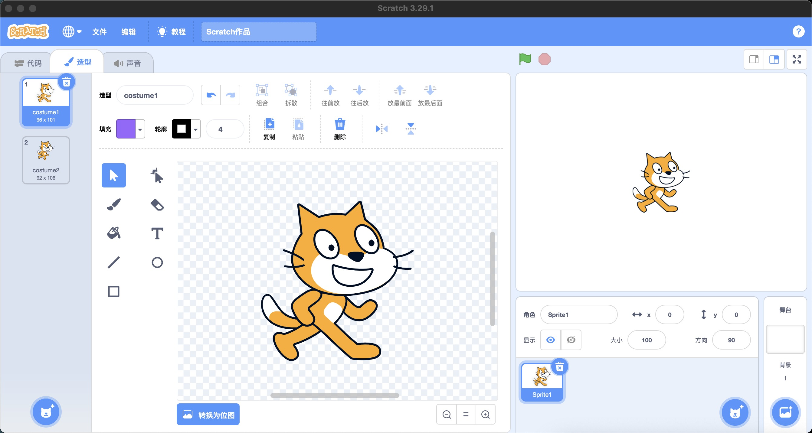
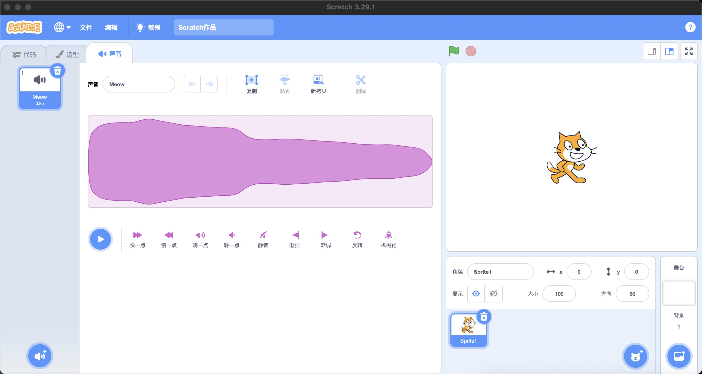

## 技巧
- 跳跃（3PicoShow）
- 切换背景造型（1DancingGirl）
- 播放声音和等待播完的区别（1dancingGirl）
- 不可旋转后再旋转改变朝向（2-crab）
- 随机数设置旋转角度(5-PongStarter)
- 

## 7点击角色加分
思路

1. 初始化
2. 角色随机出现：使用随机数瞬间移动角色
3. 隐藏角色
4. 鼠标点击 播放声音 加一分

## 整理

- 一系列连接的块称为脚本。

- 脚本是告诉角色要做什么的指令集。
- 造型是角色可以穿着的不同图像，可用于创建动画。
- 声音剪辑是角色可以播放的短音频剪辑。

## 程序(Program)是什么
程序是人们为计算机设计的一组指令的集合，通过指令指挥计算机如何完成一项任务。编写程序的过程就是编写指令的过程。

程序员通常使用比机器代码更容易被人类理解的高级编程语言，

## 指令

## 脚本是什么

脚本是告诉Scrat中的角色要做什么的指令集。服装是精灵可以穿着的不同图像，可用于创建动画。声音剪辑是精灵可以播放的短音频剪辑。

## 参考

- https://www.inc.com/glenn-leibowitz/steve-jobs-believed-everyone-should-learn-this-1-s.html
- 在线少儿编程：https://www.create-learn.us/#trials
- 在线少儿编程：https://learnlearn.uk/scratch/
- 在线少儿编程：https://wiingy.com/blog/scratch-coding/
- 在线少儿编程：https://www.australiancurriculum.edu.au/media/6666/scratch-3-tutorial.pdf
- 在线少儿编程：https://www.coursera.org/learn/how-computers-work
- scratch大纲：https://teachersnotes.net/2021/01/16/scratch-coding-intro-lessons-1-4/
- 在线少儿编程：https://www.teacherspayteachers.com/browse?search=scratch%20tutorial
- https://www.codecademy.com/article/what-is-programming
- Introduction to programming：https://edu.gcfglobal.org/en/computer-programming-basics/introduction-to-computer-programming/1/#
- 可视化编程：https://kissflow.com/low-code/visual-programming-overview/
- 儿童应该学习编程：https://www.inc.com/glenn-leibowitz/steve-jobs-believed-everyone-should-learn-this-1-s.html
- 编译器：https://www.youtube.com/watch?app=desktop&v=zIjI8H945T8
- https://www.geeksforgeeks.org/basics-of-scratch-programming/?ref=ml_lbp
-  Introduction to Scratch 1: Sprites ：https://www.youtube.com/watch?v=JEyTQtxSiXI
- scratch视频教程：https://www.udemy.com/course/scratch-game-programming/learn/lecture/5338014#overview
-  Make a Health Bar | Scratch Tutorial https://www.youtube.com/watch?v=Faf6NelRMA8&list=PL1Kf26jNaYZivqPEFB-QpQnhFmoEwuDAj&index=1
-   Scratch Programming Animation : Pen Animation ：https://www.youtube.com/watch?v=VbRdJdRcY1U
-   https://www.youtube.com/@KidsLearningforLife
-    The Scratch Programming Interface 
- Blocks: [https://en.scratch-wiki.info/wiki/Blocks](https://en.scratch-wiki.info/wiki/Blocks)
- Scratch社区：[https://scratch.mit.edu/](https://scratch.mit.edu/)
- Codakid：[https://codakid.com/scratch-sprites/](https://codakid.com/scratch-sprites/)
- 打包项目：[https://packager.turbowarp.org/](https://packager.turbowarp.org/)
- 变量：https://www.geeksforgeeks.org/variables-in-scratch-programming/

### 导航条（Navigation Bar）

导航条的功能主要包括：

- 语言选项：修改界面语言
- 文件：创建、保存文件
- 编辑：打开加速模式
- 教程：官方提供的教程
- 文件标题：修改文件标题

### 代码面板(Code Pane)
代码面板是为角色编写程序(控制精灵)的主要区域。

代码面板由两部分构成：

- 图形块面板：垂直排列着9个彩色圆形图标，表示九个类别的图形块。
- 编程区：编排图形块的区域，通过拖动图形块编写程序脚本。

主条目：扩展

扩展按钮是块面板类别下方的紫色按钮。它允许用户添加扩展，将新的可能的块添加到块面板，就像与其他设备通信的块一样。
代码区

主条目：代码区

代码区域是块面板右侧的大空间。它是用于存储运行项目的块的区域。可以将块从块面板拖到代码区域并排列以形成脚本。每个精灵都有自己的脚本，并且可以使用精灵窗格选择精灵。

### 造型面板(Costume Pane)
造型选项卡(Tabs)允许用户使用绘画编辑器更改精灵的外观。

### 声音面板(Sounds Pane)
声音选项卡(Tabs)使用声音编辑器来编辑声音。

### 角色窗
角色窗位于脚本区域右侧、舞台下方。它允许人们快速切换角色并查看每个角色包含的不同脚本。

### 背景窗
背景窗是块面板和脚本区域底部的一个小区域。点击它就可以打开它。它存储脚本、服装和声音，并允许它们从一个项目转移到另一个项目。可以通过将脚本、服装或声音拖放到背景窗中来添加它们。如果其他项目的工作被用于自己的项目中，这尤其有用。

对于编程初学者，Scratch的界面设计让编程变得更直观，也更容易。
- 块面板
- 代码区

## Scratch的结构

Scratch 是一种多角色的编程语言。

- 每个角色都有独特的特征，比如造型、大小、位置、效果和私有变量。
- 块是运行项目的代码片段，每个角色都有自己的块，独立于其他角色的块。
- 角色在舞台上相互交互，它们可以使用广播、变量和传感块相互通信。
- 每个角色的块显示在代码区域中，它们被构造成脚本，这些脚本是一起运行的连接块链。
- 块面板包含所有块的列表，也是从其中拖动块的位置。这些块被分为 9 个或更多不同的类别：
    - 运动
    - 外观
    - 声音
    - 事件
    - 控制
    - 传感
    - 操作符
    - 变量
    - 我的块
    - 任何扩展的其他类别
- 有些块可以移动角色或更改其外观，有些可以与其他角色或舞台交互，而其他块则执行内部操作，例如数学或更改变量和列表。