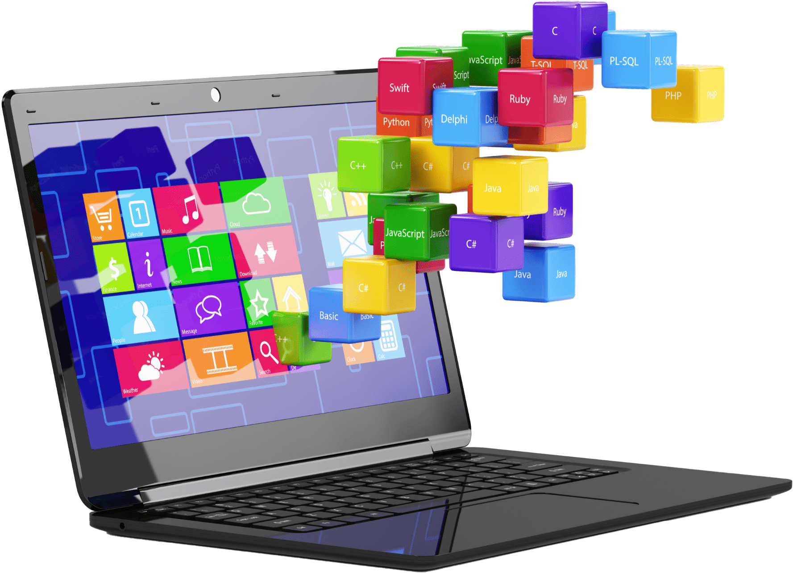
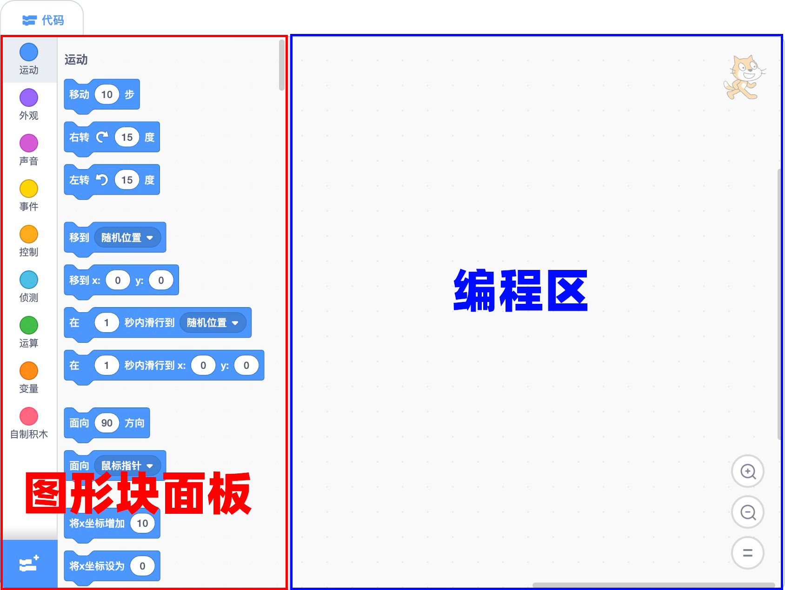

## 参考

- [7 Easy Scratch Project Ideas](https://www.codewizardshq.com/scratch-project-ideas/)
- [Scratch Project Ideas for Kids and Beginners](https://www.codewizardshq.com/scratch-project-ideas/#scratcher)
- [How to make a scrolling background in Scratch](https://www.codingal.com/coding-for-kids/blog/make-a-scrolling-background-in-scratch/)

## 技巧
- 跳跃（3PicoShow）
- 切换背景造型（1DancingGirl）
- 播放声音和等待播完的区别（1dancingGirl）
- 不可旋转后再旋转改变朝向（2-crab）
- 随机数设置旋转角度(5-PongStarter)
- 

## 7点击角色加分
思路

1. 初始化
2. 角色随机出现：使用随机数瞬间移动角色
3. 隐藏角色
4. 鼠标点击 播放声音 加一分

## 整理

- 一系列连接的块称为脚本。

- 脚本是告诉角色要做什么的指令集。
- 造型是角色可以穿着的不同图像，可用于创建动画。
- 声音剪辑是角色可以播放的短音频剪辑。

## 程序(Program)是什么
程序是人们为计算机设计的一组指令的集合，通过指令指挥计算机如何完成一项任务。编写程序的过程就是编写指令的过程。

程序员通常使用比机器代码更容易被人类理解的高级编程语言，

## 指令

## 脚本是什么

脚本是告诉Scrat中的角色要做什么的指令集。服装是精灵可以穿着的不同图像，可用于创建动画。声音剪辑是精灵可以播放的短音频剪辑。

## 参考

- https://www.inc.com/glenn-leibowitz/steve-jobs-believed-everyone-should-learn-this-1-s.html
- 在线少儿编程：https://www.create-learn.us/#trials
- 在线少儿编程：https://learnlearn.uk/scratch/
- 在线少儿编程：https://wiingy.com/blog/scratch-coding/
- 在线少儿编程：https://www.australiancurriculum.edu.au/media/6666/scratch-3-tutorial.pdf
- 在线少儿编程：https://www.coursera.org/learn/how-computers-work
- scratch大纲：https://teachersnotes.net/2021/01/16/scratch-coding-intro-lessons-1-4/
- 在线少儿编程：https://www.teacherspayteachers.com/browse?search=scratch%20tutorial
- https://www.codecademy.com/article/what-is-programming
- Introduction to programming：https://edu.gcfglobal.org/en/computer-programming-basics/introduction-to-computer-programming/1/#
- 可视化编程：https://kissflow.com/low-code/visual-programming-overview/
- 儿童应该学习编程：https://www.inc.com/glenn-leibowitz/steve-jobs-believed-everyone-should-learn-this-1-s.html
- 编译器：https://www.youtube.com/watch?app=desktop&v=zIjI8H945T8
- https://www.geeksforgeeks.org/basics-of-scratch-programming/?ref=ml_lbp
-  Introduction to Scratch 1: Sprites ：https://www.youtube.com/watch?v=JEyTQtxSiXI
- scratch视频教程：https://www.udemy.com/course/scratch-game-programming/learn/lecture/5338014#overview
-  Make a Health Bar | Scratch Tutorial https://www.youtube.com/watch?v=Faf6NelRMA8&list=PL1Kf26jNaYZivqPEFB-QpQnhFmoEwuDAj&index=1
-   Scratch Programming Animation : Pen Animation ：https://www.youtube.com/watch?v=VbRdJdRcY1U
-   https://www.youtube.com/@KidsLearningforLife
-    The Scratch Programming Interface 
- Blocks: [https://en.scratch-wiki.info/wiki/Blocks](https://en.scratch-wiki.info/wiki/Blocks)
- Scratch社区：[https://scratch.mit.edu/](https://scratch.mit.edu/)
- Codakid：[https://codakid.com/scratch-sprites/](https://codakid.com/scratch-sprites/)
- 打包项目：[https://packager.turbowarp.org/](https://packager.turbowarp.org/)
- 变量：https://www.geeksforgeeks.org/variables-in-scratch-programming/
## 资料

- https://funtech.co.uk/latest/what-is-sprite-in-scratch-coding
- https://www.idtech.com/blog/what-are-scratch-sprites
- https://www.codingkids.com.au/scratch/new-to-sprites-in-scratch/

## 素材下载

- 图标下载：https://www.flaticon.com/

### 导航条（Navigation Bar）

导航条的功能主要包括：

- 语言选项：修改界面语言
- 文件：创建、保存文件
- 编辑：打开加速模式
- 教程：官方提供的教程
- 文件标题：修改文件标题

### 代码面板(Code Pane)
代码面板是为角色编写程序(控制精灵)的主要区域。

代码面板由两部分构成：

- 图形块面板：垂直排列着9个彩色圆形图标，表示九个类别的图形块。
- 编程区：编排图形块的区域，通过拖动图形块编写程序脚本。

主条目：扩展

扩展按钮是块面板类别下方的紫色按钮。它允许用户添加扩展，将新的可能的块添加到块面板，就像与其他设备通信的块一样。
代码区

主条目：代码区

代码区域是块面板右侧的大空间。它是用于存储运行项目的块的区域。可以将块从块面板拖到代码区域并排列以形成脚本。每个精灵都有自己的脚本，并且可以使用精灵窗格选择精灵。

### 造型面板(Costume Pane)
造型选项卡(Tabs)允许用户使用绘画编辑器更改精灵的外观。

### 声音面板(Sounds Pane)
声音选项卡(Tabs)使用声音编辑器来编辑声音。

### 角色窗
角色窗位于脚本区域右侧、舞台下方。它允许人们快速切换角色并查看每个角色包含的不同脚本。

### 背景窗
背景窗是块面板和脚本区域底部的一个小区域。点击它就可以打开它。它存储脚本、服装和声音，并允许它们从一个项目转移到另一个项目。可以通过将脚本、服装或声音拖放到背景窗中来添加它们。如果其他项目的工作被用于自己的项目中，这尤其有用。

对于编程初学者，Scratch的界面设计让编程变得更直观，也更容易。
- 块面板
- 代码区

## Scratch的结构

Scratch 是一种多角色的编程语言。

- 每个角色都有独特的特征，比如造型、大小、位置、效果和私有变量。
- 块是运行项目的代码片段，每个角色都有自己的块，独立于其他角色的块。
- 角色在舞台上相互交互，它们可以使用广播、变量和传感块相互通信。
- 每个角色的块显示在代码区域中，它们被构造成脚本，这些脚本是一起运行的连接块链。
- 块面板包含所有块的列表，也是从其中拖动块的位置。这些块被分为 9 个或更多不同的类别：
    - 运动
    - 外观
    - 声音
    - 事件
    - 控制
    - 传感
    - 操作符
    - 变量
    - 我的块
    - 任何扩展的其他类别
- 有些块可以移动角色或更改其外观，有些可以与其他角色或舞台交互，而其他块则执行内部操作，例如数学或更改变量和列表。

## 设计颜色值

- `00BFF3` 浅蓝色
- `7501CB` 紫色
- `0D8E6A` 绿色
- `FFC617` 黄色

## 关于少儿编程

在当今的数字世界中，编码是一项基本技能。开始学习永远不会太早。许多人认为，学校应该将编程与数学和阅读等其他传统科目一起教授。计算机是工具。虽然学习编程一开始可能会令人沮丧，但如果你选择坚持下去，你将能够做出一些精彩的事情。

1. 编程可以帮助孩子培养逻辑思维和解决问题的能力。
2. 编程教会孩子如何在团队中良好工作。
3. 学习编码打开就业机会之门。
4. 学习编码可以让孩子们对技术更有信心。

张雪峰老师谈：哪些孩子适合学编程

> 不是身边很多孩子从小就在学习编程吗？在小学阶段，通过编程启蒙构建孩子对于编程的认知，了解编程的语言逻辑、代码逻辑，而且在学习编程的过程当中会使用到大量的数学知识，数学思维，还有相关的方法。学习编程呢，对于希望在理科上有所提升的孩子是如虎添翼，那到底哪些孩子适合学编程呢？一是好奇心重的孩子，他们想象力特别丰富，非常适合编程这种创意类的项目。动手又动脑，因为编程啊，是一种思维方式和解决问题的工具，通过编程，我们可以将抽象的想法转化为具体的实现，创造出各种应用和软件。少儿编程则是针对少年儿童的编程教育，主要是通过教授编程语言和编程思维来培养孩子的逻辑思维、创新能力和解决问题的能力。整个学习的过程呢，也是从易到难，从最基础的图形化体能过渡Python，再尝试测试C++等高级编程语言的学习。二是平时做事比较粗心，缺乏规划的孩子。编程讲究逻辑的缜密性，在学习编程的过程中，可以在早期阶段培养孩子良好的思维习惯和解决问题的能力，为他们未来的学习和职业生涯打下坚实的基础。但千万别以为学了少儿编程以后，孩子就能成为程序员了，那就太片面了。第三呢，也是最重要的一点，就是可以利用编程来规划科技特长生路线，助力孩子未来升学。

乔布斯：人人应该学编程

>"I think everybody in this country should learn how to program a computer, should learn a computer language, because it teaches you how to think. I view computer science as a liberal art. It should be something that everyone takes."  “我认为这个国家的每个人都应该学习如何编程计算机，应该学习计算机语言，因为它教你如何思考。我认为计算机科学是一门文科。它应该是每个人都学习的东西。”

## 角色的三种功能
创建角色后，可以对角色进行编程、更换造型和添加声音的操作。

### 编程功能
每个角色都有自己的脚本区域，可以使用指令（图形块）控制角色，从而编写程序。

- 调整角色大小
- 旋转角色
- 添加动画和效果
- 控制角色如何与舞台上的其他元素（例如墙壁和平台）交互。
  
### 造型功能
造型是角色的外观，或者说衣服。通过造型可以改变角色的外观。

- 每个角色可以拥有多个造型，但至少拥有一个造型。
- 用途：造型最常见的用途是制作动画。
- 创建造型：方法1. 从内置造型库中添加一个造型； 方法2. 使用绘画编辑器手动绘制一个； 方法3. 从电脑导入图片，尤其GIF图片，Scratch会自动分割GIF成多个造型。
- 更换造型：如果希望更换角色的造型，可以使用“外观”图形块。
- 编辑造型：方法1:使用像素绘制造型 方法2:使用矢量线条绘制造型
- 删除造型：点击造型图标右上角的“X”可以删除造型
### 添加声音

声音面板让角色可以绑定声音。

打开声音面板，找到“选择一个声音”按钮，可以为角色添加声音：

- 可以从内置声音库中选择并添加声音
- 也可以从本地电脑中上传声音
- 还可以自己录制声音

