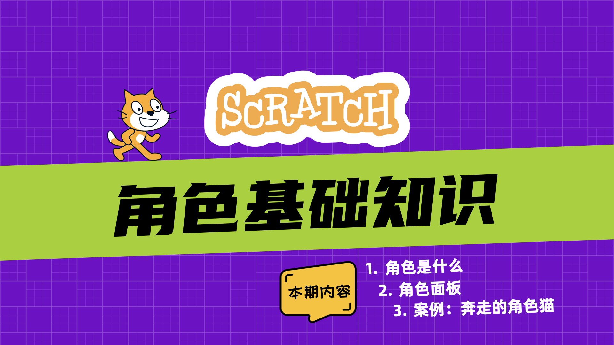
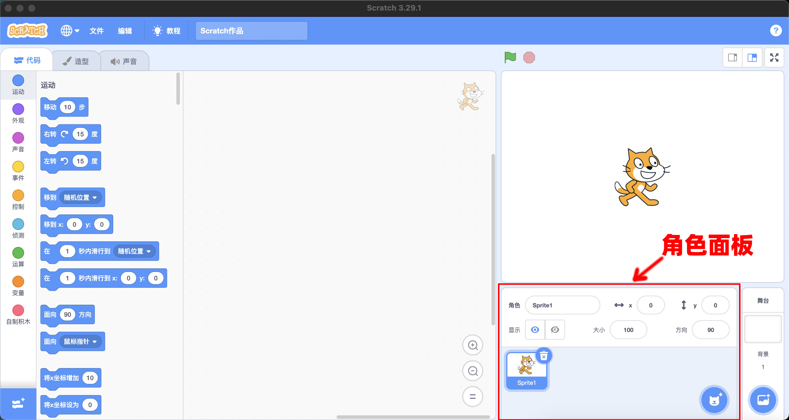
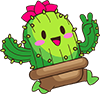
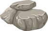

打开Scratch编辑器后，角色出现在屏幕右下方的角色面板中。默认情况下，角色面板中会显示一只猫。猫就是一个角色。

## 角色是什么
{width="80"}
{width="100"}
{width="100"}
{width="100"}

Scratch的主要用途是制作动画和游戏，而角色就是动画和游戏中的演员。从技术角度讲：

- **角色是一张图片**。任何图片都可以成为角色，比如，图片可以是人物、动物、植物或者一个块石头等等。
- 与普通图片不同的是，**角色是一张可以编程的图片。** 这句话的意思是：每个角色除了是图片之外，还有三个重要的属性，分别是：
    - “代码”
    - “造型”
    - “声音”
  
当选择一个“角色”之后，可以在“代码”区为角色添加代码，在造型区，可以为角色设置多个不同的外观，在声音区可以为角色绑定声音。

## 角色面板
**角色面板用于管理程序中用到的角色**，角色面板包含三个部份：

- 添加角色按钮：提供四种添加角色的方法
- 角色列表区：以缩览图形式列出项目中的所有角色，是访问角色的入口。
- 角色参数区：设置角色参数；比如：角色的名称、位置、大小和方向

### 添加角色按钮
将鼠标悬停在添加角色按钮{width="40"}上方，可以看到Scratch提供了4种添加角色的方法：

- ：从角色库中选择一个角色
- ：手动绘制一个角色
- ：从角色库中随机选择一个角色
- ：从本地电脑中上传一张图片作为角色。（图片格式：Jpg、Jpeg、Gif、PNG、SVG）

添加角色后，角色将被自动放置在舞台上的随机位置（通常在舞台中心的周围）。从角色库中新添加的角色默认是没有代码的，但是至少会有一个造型，并且绑定了声音。你可以随时根据需要修改角色。

### 角色列表区
通常一个程序中，会用到多个角色。所有的角色都存储在角色列表区。每个角色以“缩览图”的形式存在。

- 当前选定的角色周围有一个蓝色框。
- 单击角色“览略图”可以查看当前角色的代码、造型和声音。
- 点击“缩览图”右上角的删除图标，可快速删除角色。

!!! note

    虽然 Scratch 项目中的角色、代码和造型没有数量限制，但项目文件总大小不能超过 50 MB。

### 角色参数区
通过角色参数面板可以直接修改角色的以下属性：

- 角色名称：设置角色的名称
- x坐标：设置角色的水平坐标
- y坐标：设置角色的垂直坐标
- 显示：设置角色的可见性
- 大小：使用百分比修改角色的大小
- 方向：任意旋转、水平翻转、不旋转

