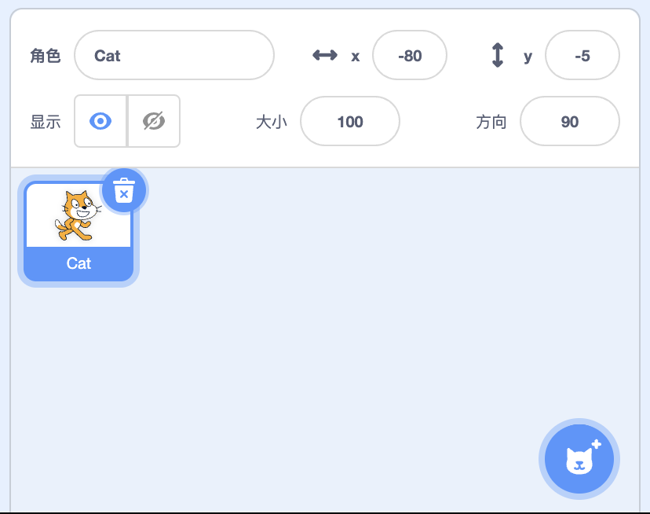
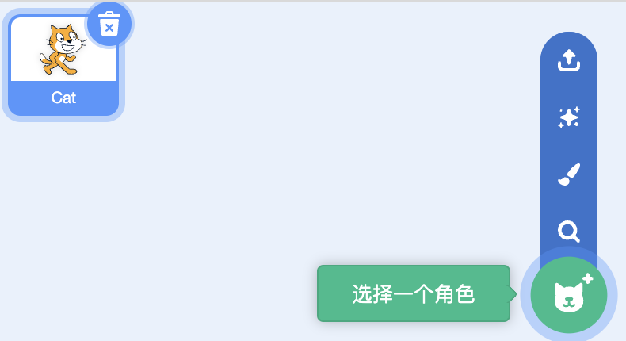

## 角色是什么
打开Scratch后，角色出现在舞台下方的角色窗中。

- **角色是图形化的对象**：在Scratch 中，角色 = 对象 + 图形。角色首先是一种对象。既然是对象，那么角色一定由许多抽象的属性和方法组成。为了把这些抽象的属性具象化，Scratch中引入了一个概念，即造型(costumes), 造型就是图形化，使用图片表达特定对象。造型相当于角色的衣服，一个角色可以拥有不止一个造型，也可以根据需要更换造型。比如先定义一只”猫“的属性，然后通过一张或多张猫图片表达猫对象的所有属性，猫可以走路、可以喵喵叫等。个人理解：造型没那么重要，只是为了讲故事和创建动画效果。
- **角色是Scratch的核心对象**: 创建角色后， 可以对角色进行编程，角色可以运动、响应事件、与其他角色交互，还可以更换造型、添加声音。

## 角色窗

角色窗是管理角色的一个区域，这个区域从下向上包含三个部份：

- 添加角色按钮：提供四种添加角色的方法
- 角色列表：以缩览图形式列出项目中的所有角色。
- 角色参数面板：设置角色参数；比如：角色的名称、位置、大小和方向

### 添加角色

Scratch提供了四种创建角色的方法。

将鼠标悬停在角色窗右下方的“选择角色”按钮上方，会显示一个菜单。菜单中有四个创建角色的按钮，分别是：

- 选择一个角色：从内置角色库中选择一个角色
- 绘制：手动绘制角色
- 随机：随机创建一个角色
- 上传角色：从本地电脑上传一张图片作为角色。上传的图片格式支持：Jpg、Jpeg、Gif、PNG、SVG

添加角色后，角色将被自动放置在舞台上的随机位置（通常在中心周围），并在当前选项卡中打开角色。

### 角色列表

角色列表中的每个角色以“缩览图”的形式存在，单击角色缩略图将打开其资源，包括脚本、造型和声音。

当前选定的角色缩览图周围有一个蓝色框，表示屏幕右侧显示的是当前角色的资源和属性。

角色缩览图右上角包含一个删除图标，可快速删除角色。

虽然 Scratch 项目中的角色、脚本或造型数量没有限制，但项目文件总大小必须低于 50 MB。此文件大小限制可确保项目可以有效且无问题地共享。因此，虽然 Scratch 项目可以拥有无​​限数量的角色，但整个项目的大小必须保持在指定的限制内。设置此限制是为了防止项目变得太大和复杂，从而使项目变得难以处理和调试。

### 角色参数
通过角色参数面板可以直接修改角色的以下属性：

- 名称
- 坐标
- 显示
- 大小
- 方向

## 角色的用法
创建玩角色后，可以对角色进行编程、修改造型、添加声音和导出的操作。

### 编程
Scratch 项目中的每个角色都有一个脚本区域，称为脚本区域。用户可以用块对角色进行编程。每个角色都有独立运行和运行的脚本，它们可以通过广播、变量或传感块相互通信。

- 调整角色大小
- 旋转角色
- 添加动画和效果
- 控制角色如何与舞台上的其他元素（例如墙壁和平台）交互。
### 修改造型
角色的外观可以通过使用造型来改变。每个角色至少有一套造型，并且可以使用外观块来更改造型。造型可以从造型库添加或绘制，并且可以使用绘画编辑器进行编辑。
### 添加声音
角色也可能有声音。声音可以被录制、从声音库添加或上传，并且可以使用声音编辑器进行编辑。
### 导出角色
角色（及其所有脚本、造型和声音）可以导出，然后根据需要导入到另一个项目中。这是通过右键单击角色窗格中角色的缩略图，然后在弹出菜单中选择“保存到本地文件”来实现的。还可以将角色拖入背包并拖出到另一个项目中进行运输。但是，这不会将角色保存到计算机上。

## 资料

- https://funtech.co.uk/latest/what-is-sprite-in-scratch-coding
- https://www.idtech.com/blog/what-are-scratch-sprites
- https://www.codingkids.com.au/scratch/new-to-sprites-in-scratch/