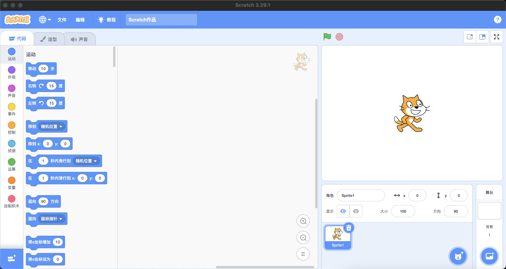
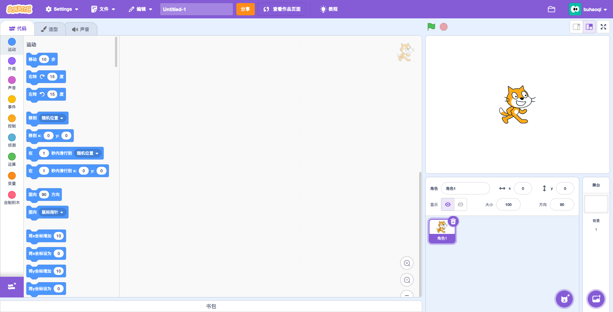
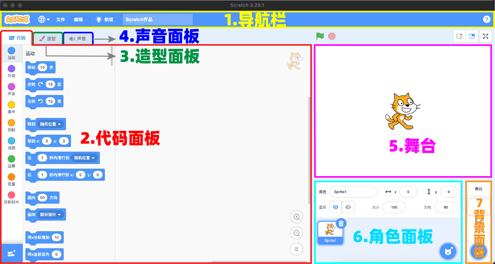
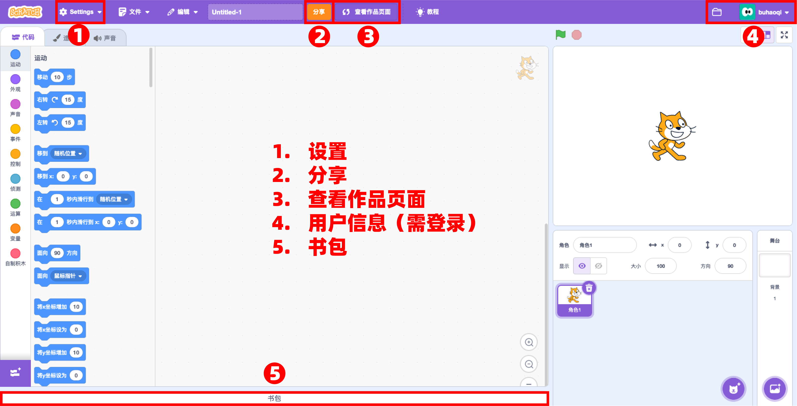

认识Scratch编辑器是学习Scratch编程的第一步。

Scratch提供了两个版本的编辑器：

- 线下编辑器
- 线上编辑器
  
## 线下编辑器

<figure markdown="span">
  
  <figcaption>Scratch</figcaption>
</figure>

“线下编辑器”指从Scratch官网下载到本地电脑中安装使用的“客户端软件”，在安装完成后，不需要联网环境即可使用。

官网提供了windows版、Mac版、安卓版和Chrome版四个版本。

下载地址是：[https://scratch.mit.edu/download](https://scratch.mit.edu/download) 

<figure markdown="span">
  
  <figcaption>Scratch线下编辑器界面</figcaption>
</figure>
## 线上编辑器
“线上编辑器”是Scratch网页版的在线编辑器。用户可以登录官网使用，无需安装Scratch的客户端软件，但需要联网环境。
<figure markdown="span">
  
  <figcaption>Scratch线上编辑器界面</figcaption>
</figure>

使用线上编辑器的方法：

- 打开浏览器(推荐“谷歌”浏览器或“360极速”浏览器)
- 登录Scratch官网：[https://scratch.mit.edu/](https://scratch.mit.edu/)
- 在首页底部找到“English”下拉框，把语言修改为“简体中文”；(英语好可跳过此步)
- 注册用户
- 点击首页顶部的“创建”按钮就可以在线编辑项目。
## 编辑器界面
Scratch编辑器的界面指编辑器的外观。通过界面，我们可以编写程序、修改程序、分享程序等。
### 七大版块
无论是“线下编辑器”还是“线上编辑器”，它们的界面和功能几乎完全一样，都包含七大核心版块：
<figure markdown="span">
  
  <figcaption>七大版块</figcaption>
</figure>

1. 导航条：主要是保存文件、修改文件标题和语言的区域
2. 代码面板：是为角色编写程序(控制精灵)的主要区域。
3. 造型面板：是修改角色造型的区域。
4. 声音面板：是为程序添加声音的区域。
5. 舞台：是展示程序效果的区域。
6. 角色面板：是管理角色的区域。
7. 背景面板：是管理背景的区域。

### 分享与交流
线上编辑器与线下编辑器的最大区别在于：**线上编辑器增加了用户作品分享和交流功能**。请看二者的不同之处：

<figure markdown="span">
  
  <figcaption>线上编辑器与线下编辑器的五个不同之处</figcaption>
</figure>

1. 设置
2. 分享
3. 查看作品页面
4. 用户信息(需登录)
5. 书包

